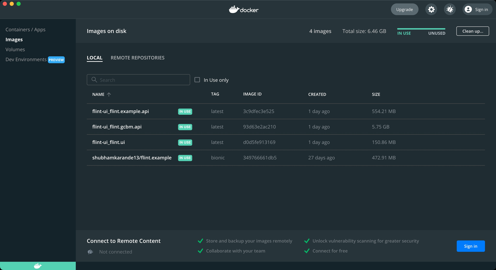
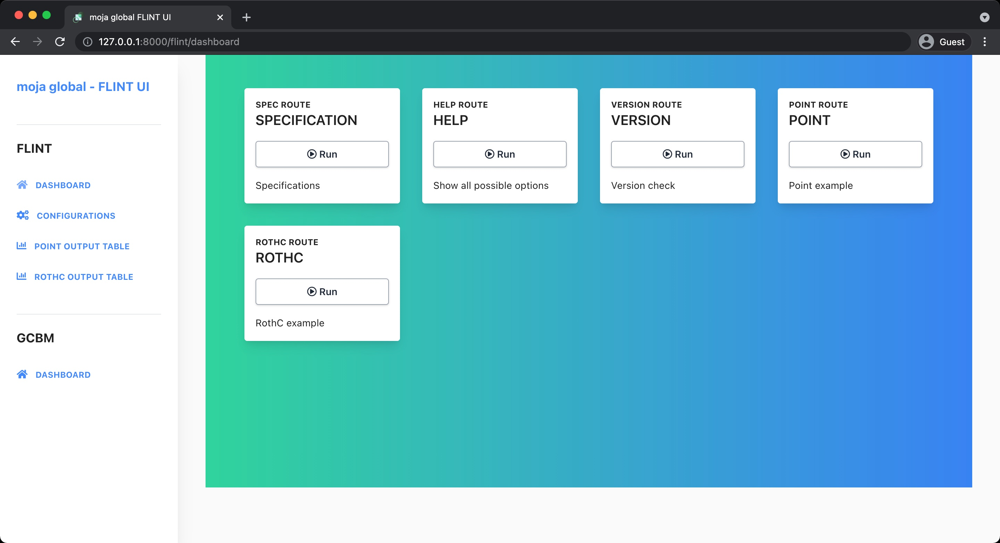

<div align="center">

<br />
<h1>FLINT UI</h1>
<p>
A FLINT client, written in Vue, to provide an awesome user interface for configuring simulations using the FLINT.Cloud APIs
  
  🚧🚧🚧🚧
  This is experimental and incomplete. The framework may be a useful starting point for new users who wish to create their own interface 
  🚧🚧🚧🚧
</p>
<a href="#contributors"></a>
<a href="https://github.com/moja-global/FLINT-UI/network/members"></a>
<a href="https://github.com/moja-global/FLINT-UI/stargazers"></a>
<a href="https://github.com/moja-global/FLINT-UI/blob/master/LICENSE"></a>
</div>

<br />

<details>
  <summary>Table of Contents</summary>
  <ol>
    <li>
      <a href="#about-the-project">About The Project</a>
      <ul>
        <li><a href="#built-with">Built With</a></li>
      </ul>
    </li>
    <li>
      <a href="#getting-started">Getting Started</a>
      <ul>
        <li><a href="#prerequisites">Prerequisites</a></li>
        <li><a href="#installation">Installation</a></li>
      </ul>
    </li>
    <li><a href="#developer-notes">Developer notes</a>
    </li>
    <li><a href="#how-to-get-involved">How to Get Involved?</a></li>
    <li><a href="#faq-and-other-questions">FAQ and Other Questions</a></li>
    <li><a href="#contributors">Contributors</a></li>
    <li><a href="#maintainers-reviewers-ambassadors-coaches">Maintainers Reviewers Ambassadors Coaches</a></li>
    <li><a href="#license">License</a></li>
  </ol>
</details>

## About The Project

This project provides an intuitive way for new to explore some preconfigured FLINT modules, including the Generic Budget Carbon Model (GCBM), in order to better understand how the FLINT system works. Our client is written as a Web application and can be used in a local or remote environment. Please contact us if you'd like help deploying your cloud instance or customizing the client.

### Built with

- [Vue.js](https://vuejs.org/)
- [Fontawesome](https://fontawesome.com/)
- [TailwindCSS](https://tailwindcss.com/)
- [Cypress](https://www.cypress.io/)
- [Apexcharts](https://apexcharts.com/)
- [Moment.js](https://momentjs.com/)
- [Google Maps](https://developers.google.com/maps)

## Getting started

### Prerequisites

In order to use and work on this project you need to install Docker for running the Docker image and Yarn to run the Vue app locally.

You can install Docker following the download's [instructions](https://docs.docker.com/get-docker/).

In order to install Yarn, open a terminal and type:

```shell
npm install -g yarn
```

### Installation

To set up this project locally follow the below procedure:

1. Pull the below docker image to run `flint.example`:

```shell
docker pull shubhamkarande13/flint.example:bionic
```

2. Clone [FLINT.UI](https://github.com/moja-global/FLINT-UI) repository:

When using submodules the installation code needs to be:

```shell
git clone --recursive https://github.com/moja-global/flint-ui
```

Or if you've already initialized the repository without the submodule

```shell
git submodule update --init --recursive
```

3. Now get inside the repository directory and build the `docker-compose.yml` file by following the below command:

```shell
docker-compose up
```

This will build all the docker images inside the `docker-compose.yml` file. It will take some time and after that, you can see all images list in the Docker app.

<div align="center">

</div>

<br />

`docker-compose.yml` file is composed of three services i.e. `flint.example.api`, `flint.gcbm.api`, `flint.ui`.

Now you can start all the containers by clicking on the `START` button or using the command `docker-compose up`. You can also use the command `docker start {name of the container}` to start the only specific container.

All containers list will look like this in the Docker app:

<div align="center">

</div>

<br />

If you want to shut down a specific container click on the `STOP` button of that specific container in the Docker app. You can also use the command line to stop a specific container by using the command `docker stop {name of the container you want to stop}`.

To shut down, the whole `docker-compose.yml` file and all services inside it then use the command `docker-compose down`.

> You can also run `docker-compose.yml` in Detached mode. Detached mode, shown by the option `--detach` or `-d`, means that a Docker container runs in the background of your terminal. It does not receive input or display output. So the command for running `docker-compose up` in Detached mode is `docker-compose up -d`.

4. To view the UI please navigate to [127.0.0.1:8000](http://127.0.0.1:8000/). UI will look something like this:

<div align="center">

</div>

## Developer notes

Go through the Development Notes [here.](https://github.com/moja-global/FLINT-UI/blob/master/docs/DevelopmentGuide/DevelopmentNotes.rst).

## Contributing

To contribute to FLINT-UI:

Go through our contributing guidelines over [here.](https://github.com/moja-global/About_moja_global/tree/master/Contributing#community-contributions).

## How to Get Involved?

moja global welcomes a wide range of contributions as explained in [Contributing document](https://github.com/moja-global/About-moja-global/blob/master/CONTRIBUTING.md) and the [About moja-global Wiki](https://github.com/moja-global/.github/wiki).

## FAQ and Other Questions

- You can find FAQs on the [Wiki](https://community.moja.global/docs/about-moja-global).
- If you have a question about the code, submit [user feedback](https://github.com/moja-global/About-moja-global/blob/master/Contributing/How-to-Provide-User-Feedback.md) in the relevant repository
- If you have a general question about a project or repository or moja global, [join moja global](https://github.com/moja-global/About-moja-global/blob/master/Contributing/How-to-Join-moja-global.md) and
  - [submit a discussion](https://help.github.com/en/articles/about-team-discussions) to the project, repository or moja global [team](https://github.com/orgs/moja-global/teams)
  - [submit a message](https://get.slack.help/hc/en-us/categories/200111606#send-messages) to the relevant channel on [moja global's Slack workspace](https://mojaglobal.slack.com/).
- If you have other questions, please write to info@moja.global

## Contributors

Thanks go to these wonderful people ([emoji key](https://allcontributors.org/docs/en/emoji-key)):

<!-- ALL-CONTRIBUTORS-LIST:START - Do not remove or modify this section -->
<!-- prettier-ignore -->
<table><tr><td align="center"><a href="http://moja.global"><br /><sub><b>moja global</b></sub></a><br /><a href="#projectManagement-moja-global" title="Project Management">📆</a></td></tr></table>

<!-- ALL-CONTRIBUTORS-LIST:END -->

This project follows the [all-contributors](https://github.com/all-contributors/all-contributors) specification. Contributions of any kind are welcome!

## Maintainers Reviewers Ambassadors Coaches

The following people are Maintainers, Reviewers, Ambassadors, or Coaches.

<table><tr><td align="center"><a href="http://moja.global"><br /><sub><b>moja global</b></sub></a><br /><a href="#projectManagement-moja-global" title="Project Management">📆</a></td></tr></table>

- **Maintainers** review and accept proposed changes
- **Reviewers** check proposed changes before they go to the Maintainers
- **Ambassadors** are available to provide training related to this repository
- **Coaches** are available to provide information to new contributors to this repository

## License

This project is released under the [Mozilla Public License Version 2.0](https://github.com/moja-global/FLINT-UI/blob/master/LICENSE).
