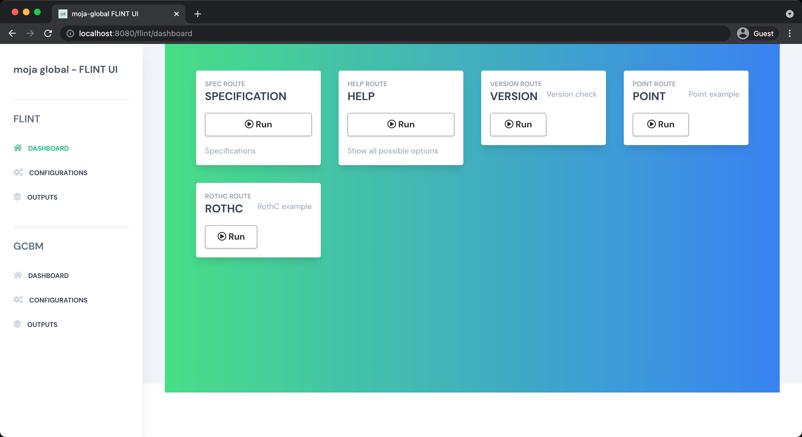

<div align="center">
<h1>FLINT UI</h1>
<p>
A FLINT client, written in Vue, to provide an awesome user interface for configuring simulations using the FLINT.Cloud APIs.
</p>
<a href="#contributors"></a>
<a href="https://github.com/moja-global/FLINT-UI/network/members"></a>
<a href="https://github.com/moja-global/FLINT-UI/stargazers"></a>
<a href="https://github.com/moja-global/FLINT-UI/blob/master/LICENSE"></a>
</div>

## About Project

This project provides an intuitive way for new to explore some preconfigured FLINT modules, including the Generic Budget Carbon Model (GCBM), in order to better understand how the FLINT system works. Our client is written as a Web application and can be used in a local or remote environment. Please contact us if you'd like help deploying your own cloud instance or customizing the client.

## Usage

To set up this project locally follows the below procedure:

1. Clone [FLINT.Example](https://github.com/moja-global/FLINT.Example) repository. A `Dockerfile` is inside the `Docker` folder. So to build the image follow the below command:

```shell
cd Docker
docker build --build-arg NUM_CPU=8 -t moja/flint.example:bionic .
```

It will take some time to build the image. For more information, you can follow [https://docs.moja.global/en/latest/DevelopmentSetup/docker_installation_example.html](https://docs.moja.global/en/latest/DevelopmentSetup/docker_installation_example.html).

2. Clone [FLINT.UI](https://github.com/moja-global/FLINT-UI) repository:

When using submodules the installation code needs to be:

```shell
git clone --recursive https://github.com/moja-global/flint-ui
```

Or if you've already initialized the repository without the submodule

```shell
git submodule update --init --recursive
```

Now you have to get inside the repository directory and to build the `docker-compose.yml` file follow the below command:

```shell
docker-compose up
```

This will build all the docker images inside the `docker-compose.yml` file. It will take some time and after that, you can see all images list in the Docker app.

<div align="center">

</div>

`docker-compose.yml` file is compose of three services i.e. `flint.example.api`, `flint.gcbm.api` and `flint.ui`.

Now you can run any all the containers by clicking on the `RUN` button. You can use the command line too to run these images. All containers list will look like this in the Docker app:

<div align="center">

</div>

<br />

> You may encounter a problem with the `flint.gcbm.api` containers because it is not refactored for a local environment yet.

Also, if you feel like running Vue app locally you can follow the below procedure:

Go to the `flint.ui` folder of [FLINT.UI](https://github.com/moja-global/FLINT-UI) repository and run the below command:

```shell
npm install
npm run serve
```

Now you can redirect to `http://localhost:8080/` and you will be able to see the dashboard someting like this:

<div align="center">

</div>

## How to Get Involved?

moja global welcomes a wide range of contributions as explained in [Contributing document](https://github.com/moja-global/About-moja-global/blob/master/CONTRIBUTING.md) and the [About moja-global Wiki](https://github.com/moja-global/.github/wiki).

## FAQ and Other Questions

- You can find FAQs on the [Wiki](https://github.com/moja.global/.github/wiki).
- If you have a question about the code, submit [user feedback](https://github.com/moja-global/About-moja-global/blob/master/Contributing/How-to-Provide-User-Feedback.md) in the relevant repository
- If you have a general question about a project or repository or moja global, [join moja global](https://github.com/moja-global/About-moja-global/blob/master/Contributing/How-to-Join-moja-global.md) and
  - [submit a discussion](https://help.github.com/en/articles/about-team-discussions) to the project, repository or moja global [team](https://github.com/orgs/moja-global/teams)
  - [submit a message](https://get.slack.help/hc/en-us/categories/200111606#send-messages) to the relevant channel on [moja global's Slack workspace](mojaglobal.slack.com).
- If you have other questions, please write to info@moja.global

## Contributors

Thanks goes to these wonderful people ([emoji key](https://allcontributors.org/docs/en/emoji-key)):

<!-- ALL-CONTRIBUTORS-LIST:START - Do not remove or modify this section -->
<!-- prettier-ignore -->
<table><tr><td align="center"><a href="http://moja.global"><br /><sub><b>moja global</b></sub></a><br /><a href="#projectManagement-moja-global" title="Project Management">📆</a></td></tr></table>

<!-- ALL-CONTRIBUTORS-LIST:END -->

This project follows the [all-contributors](https://github.com/all-contributors/all-contributors) specification. Contributions of any kind are welcome!

## Maintainers Reviewers Ambassadors Coaches

The following people are Maintainers Reviewers Ambassadors or Coaches

<table><tr><td align="center"><a href="http://moja.global"><br /><sub><b>moja global</b></sub></a><br /><a href="#projectManagement-moja-global" title="Project Management">📆</a></td></tr></table>

**Maintainers** review and accept proposed changes
**Reviewers** check proposed changes before they go to the Maintainers
**Ambassadors** are available to provide training related to this repository
**Coaches** are available to provide information to new contributors to this repository

## License

[Mozilla Public License Version 2.0](https://github.com/moja-global/FLINT-UI/blob/master/LICENSE)
